文章摘要：现在连买菜大大妈都在聊GPT，有的人试用就再也没有折腾过，有的人已经把他弄成日常，每天不问就干不了活的那种，还有一种就人对应它来或者不来都无所谓。但是ChatGPT的由来和历史到底是什么呢，今天，我就用大白话，斗胆盘到盘到ChatGPT

## **前言**

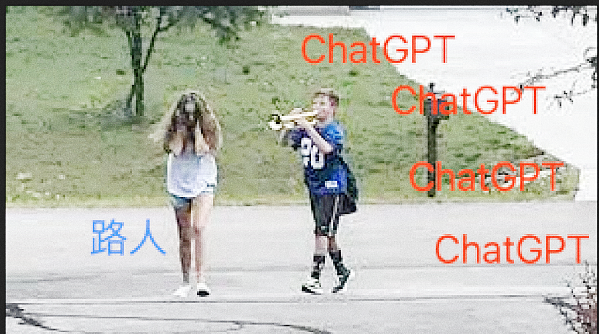

其实现在写这个文章，连买菜大大妈可能都在聊GPT的时候，都感觉已经过了热度，有的人试用了就再也没有折腾过，有的人已经把他弄成了日常，每天不问都不行的那种，还有一种就是无论它来或者不来，都没摸过（当然这种我们写代码的人里的比较少，大概都用过）。

大家对它最感性的认识就是ChatGPT里面的Chat，我问它答，继续问, 继续回答

这种交互很原始，就跟我们搜索问题一样，但是很高效，很多问题能够通过聊天的形式解答。

甚至时不时的会让人感觉非常惊艳。

## **历程**

**GPT**全称  generative pre-trained transformer，我们中文又叫 生成式预训练大模型程序

**Generative** 生成式，那就 很直观，生成这种形式来生成有意义的文本

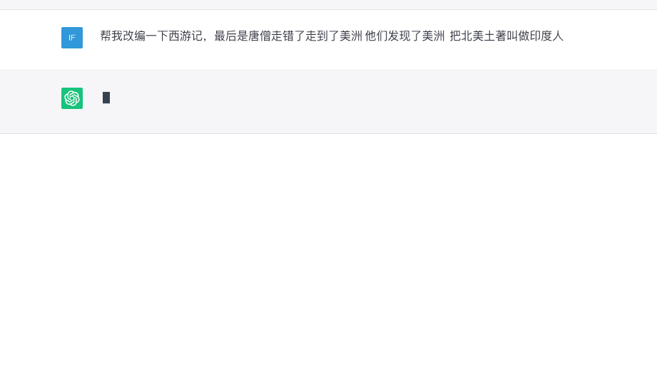

**Pre-trained** 预训练  就是我们理解的很多很多浩如烟海的数据进行预训练

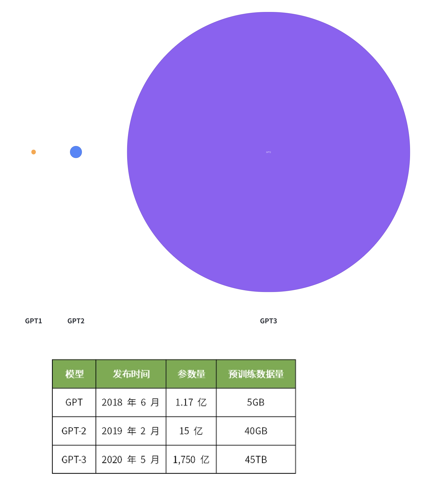

**Transformer**呢，好像不是大模型？这意思是变形金刚？

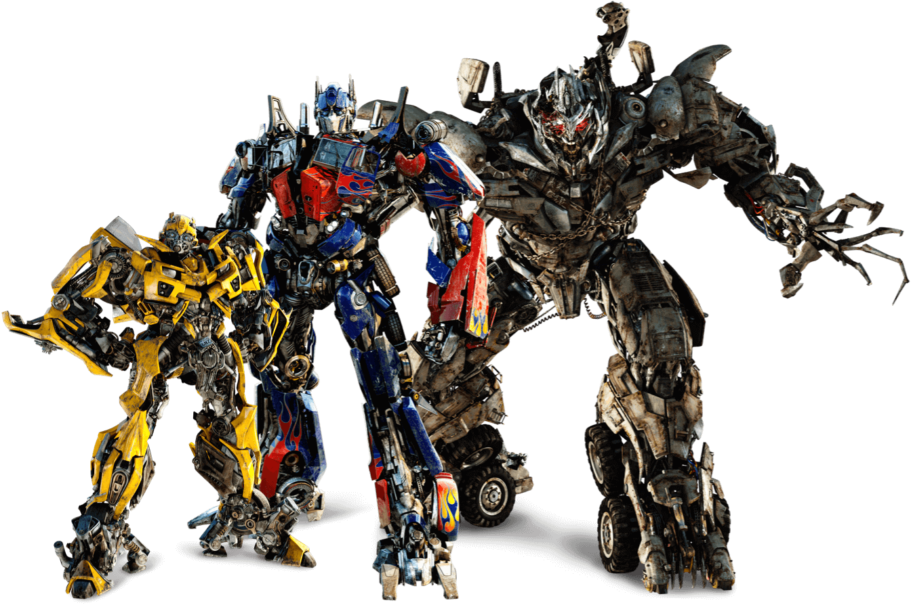

诶 这里就说道一个重点了，ChatGPT里面最重要的东西 **Transformer**

不过这里先按下不表，先聊聊NLP的历史。

### **NLP**

说起语言处理，大家都会自然而然的想到一个词 NLP（ 自然语言处理），这也算是计算机一门源远流长的学科了

平时大家都接触的不算少，最有名就是傻乎乎的siri，还有更傻的小爱同学

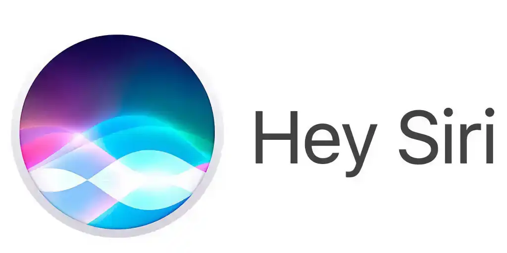

估计大家用的最顺手的就是**翻译 ** **（看看以下哪个翻译有亮点 😏）**

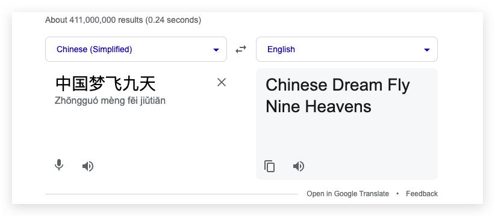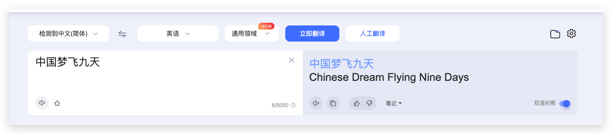

**翻译**这件事件其实也是源远流长了，老NLP了，早在冷战时期，美国IBM就开始建立了乔治敦实验室专门就是为了把俄语技术资料翻译成英语

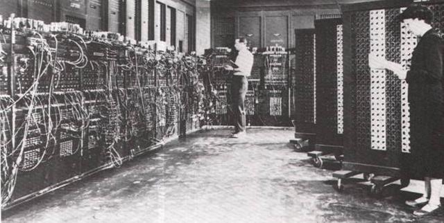

当然当时用的方法不是什么机器学习，主要还是一些规则，把英语和俄语都拆成很小的单元，然后再去用词汇和语法规则去对应，有点像我们查字典，而且就是就是就像我们把每个词语拿出来硬翻译一样。

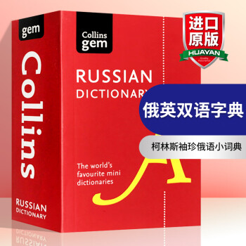

后来计算机行业才慢慢开始有了机器学习的说法

### **CNN** 

机器学习大家其实以前遇到比较多的是图像识别这一类的，比如我们组的Ai训练平台用的yolo就是用的CNN卷积神经网络，而CNN，大家对其的大概印象就是一个二维矩阵（先以灰度图为例）

- 输入层

- 卷积层，使用卷积核对特征进行提取（当然这里面涉及到，步长，留白，还有卷积核的选取，这里面就有太多可说的了，这里不是主讲这个先略过）

- 还有激励层 是为了将这种线性关系打乱
- 池化层其实还是为了降低数据纬度，将特征搞得更明显 当然还有各种各样的层放在里面 最后输出一个模型用于我们识别

### **Word2vec**

从上面看出来其实计算机打交道的都是这些数字，上面这些数字代表的就是黑白图的里面每个像素的灰度，那么计算机理解这些灰度其实就是讲这些值看成了向量去做计算。

同样的 **计算机是怎么去理解现实世界的呢**，譬如说我们在浏览淘宝的时候 有很多商品，比如这时候搜搜了一个4090显卡，那在我点进某个宝贝的时候，一般下面都会提示很多猜我喜欢的商品。

计算机是怎么理解我的商品的，然后推荐出猜我喜欢的商品的？

我们可以姑且认为每一个商品都有 **颜色 ，大小，型号**，我将其理解为 x，y，z，那么将这些商品是排到一个x,y,z 三维的坐标轴上，我们就可以看到这样的分布

其实可以看到 离我看的这个商品欧拉距离最近的 **一定就是很相近的商品**，计算机也就是理解相似的。

##### **语言**

那刚才说了那么久关于向量，数据的事情，那么语言呢，语言是不是也可以向量化？

当然是可以，但是语言怎么向量化？

可能有人会说像素都用颜色值表示，语言可以用 unicode 表示，

像素 的颜色值它是有具体含义的，这个值就是这个数，就代表这个黑的程度

**语言经过成百上千年的锤炼是很复杂的**

> 举个例子🌰

> 比如 **饼** 这个子。unicode 是 \u997c但是 \u997c 只是一个编号  他并没有什么含义，并没表达出 这个东西 又大又圆 还能吃

> 比如🍪  的 unicode是 **\ud83c\udf6a**\ud83c\udf6a 和  \u997c 是什么关系，一点都表达不出来     但是  🍪 和饼就是有关系的，我们该如何表达这层关系？

通过上面的例子，可以看到，**语言是一门高度抽象的东西，我们甚至连他的维度都不知道，也不能说是分成x，y，z这三维就能去做做解释，它很明显是非常高维度的东西，我们只能通过计算机自己去找到语言特征，以及向量。**

举个例子  🌰

> 我们让计算机去理解古诗，我们第一步先确定语言的维度，要复杂一些比如512维，就是把古诗的每个字都理解成一个512维的向量，然后我们随便把每个字都给一个向量，打乱了，丢在计算机训练。

##### **怎么训练？**

我们让计算机去理解古诗，我们第一步先确定语言的维度，要复杂一些比如512维，就是把古诗的每个字都理解成一个512维的向量，然后我们随便把每个字都给一个向量，打乱了，丢在计算机训练。

回答  大饼

**啪，就是一巴掌**，然后调整向量值，继续猜，

回答 饭香 ，**啪，又是一巴掌**，继续调整向量值

最后上千百次的训练，终于调整到了合适的向量，回答出来 **明月**，同样的将大规模的文本进行这样训练后，我们就能做到文本的向量化了

如图所示，很明显，向量几何距离离得近的，都是意思相近的 比如 男人  和 man就挨得很近

文字向量化后事情就变得非常有意思，比如能做一些向量计算

Sun + flower = sunflower

或者如图

这个过程叫做**词的向量化**

也不是什么新鲜事情，

其实在2013年 google就提出来  **word2vec**

[https://code.google.com/archive/p/word2vec/](https://code.google.com/archive/p/word2vec)

但，这只是做了第一步，**把数据向量化**

就像刚才处理图片一样，才把只是把图片数据的二维向量拿出来**（当然文本不只是二维）**

**连输入层都还没到**

### **RNN**

> **好了 说到这里，我们要开始稍微上一点难度了，有公式了，但是大家就意会就行** 

> **不用纠结里面太多的细节，不然后面会容易绕晕 😴**

> **抓稳坐好，开始提速了 🚗**

我们下一步要干嘛呢

**数据特征提取**，就像像素组成图像一样，我们的文本刚刚才找到它的向量现在我们要去寻找它们组合的文章和句子的

##### **特征怎么找**

去找寻语言的规律，而这种找寻语句里的关系特征的网络其中最常见的就是RNN

也叫做循环神经网络，这个网络大家最直观的印象就是他的对文本序列的处理，是有传递关系的

比如第一个文本的向量经过处理 还会传递给第二个文本参与计算， 主要就是经过了输入层，循环层，隐藏层，输出层 RNN最核心就是这个 循环层，这一层的作用就是让它处理上下文的关系。 主要有以下两个公式**（不要紧张同学！！意会就行 看红字解释！！）** 

- Ot 表示在时间步 t 的输出向量； **（输出的结果，这单个字或者序列的）**
- St 表示在时间步 t 的隐藏状态，这是基于输入序列和前一时刻的隐藏状态计算得到的；**（一个中间态用于本次的输出向量计算也会传递给下一次计算）**
- V 是输出权重矩阵，表示隐藏状态 St 对输出 Ot 的贡献；**（可以理解成是一个经验数值，一般是老模型的，或者初始训练的时候随机分配后续慢慢训练出来的）**
- g 是一个激活函数，用于将输出限制在适当的范围内**（把所有的值都放在一个水平线上）**

关于隐藏状态

- St 表示当前时间步t的隐藏状态；**（本次的中间态）**
- St-1 表示前一个时间步t-1的隐藏状态； **（上次的中间体）**
- Xt 表示在时间步t的输入向量；**（输入的值）**
- f 是一个激活函数，如tanh或ReLU； （**激励函数， 将输出结果引入非线性特性，这样能表达一些更复杂的关系）**
- U 是输入权重矩阵，表示输入向量Xt对隐藏状态St的贡献；**（经验值，训练得知）**
- W 是循环权重矩阵，表示前一时刻的隐藏状态St-1对当前隐藏状态St的贡献。**（经验值，训练得知）**

很显然，RNN这种结构就是为序列数据处理而生的，但是RNN其实还有一些问题

##### **问题**

**短期记忆的问题**

RNN 在这个状态传递的过程中，离我们问的问题最近的词语一般权重是**最高的（显而易见）**

比如

**科学家在实验室中进行了一系列的研究，****最终发现了一种新型的材料****，****这种材料具有令人惊讶的特性，能够****_**____

按照 RNN的理解，从左到右，对于横线里面的要猜测的词语，权重就如图所示，那么RNN最关注的其实就是接

**这种材料具有令人惊讶的特性**

比如它会接 ，**抗击非常大的压力，用于建筑结构**

但实际上，我们人仔细看上下文，其实这里可能更大程度上 是想说 **能够突破行业瓶颈，引发新的一轮工业革命**  一类更宏大的话语。

而且前面的也展示，每次都需要传递上文给下文，每个时间步骤都依赖上文的计算，所以也没法**并行**，所以RNN 计算效率很低，时间复杂度很高。

### **Atenttion**

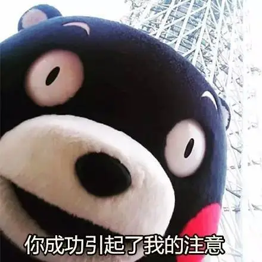

*那我们仔细再想想，我们是怎么去理解文本？*

***科学家在实验室中进行了一系列的研究，最终发现了一种新型的材料。这种材料具有令人惊讶的特性，能够_\****____*

我们大脑其实第一步是对信息做了 提炼

***科学家\******在实验室中进行了一系列的\******研究\******，最终\******发现\******了一种新型的\******材料\******。这种材料具有\******令人惊讶\******的特性，能够_\****____*

然后我们根据这个简化的信息再去进行处理，这就引入了我们新的一种序列数据处理形式

**Atenttion**

注意力机制

简单的来说 就是你注意你在做什么，理解一篇文章你得关注你要关注的，这也是最接近我们人脑的形式

类似的我们理解一张图

首先看到的肯定是这个里面的兔子，然后才是其他的

注意力机制模型

这里有 Q K V三种向量相互作用去做计算

#### **简单解释下**

我们可以理解为

Q就是我们当前要查询的某个词语

然后他去对每一个词或者字进行关联度计算，最后求和那就是，整体的 注意力的值

当然这里很多细节

> 比如这里的 三个向量 Q是 我们可以当时当前某个词查询向量

> 那 K V是啥？ K V其实也是代表了某个词的向量，分别是Key键向量和Value值向量，那前面我们理解不都是，一个一个向量的吗，咋还成对出现了，你看我们图片的向量就很简单呀，就是一个一个的向量就行，那只能说词语太复杂了，我们得用两个向量来表示

> K key向量主要是跟词语位置相关的表达某个元素的重要性和关注度

> V value 向量主要是承载的词语的相关信息

 

举一个例子 🌰

> 假设你正在组织一场晚宴，你需要为来宾提供饮料。你的任务是找出每位来宾最喜欢的饮料。在这个场景中：

> Q 向量（Query 向量）代表每位来宾的口味偏好。

> K 向量（Key 向量）代表饮料的特征，例如甜度、口感、颜色等。通过比较来宾的口味偏好（Q 向量）和饮料的特征（K 向量），你可以找出哪种饮料与来宾的口味最匹配。

> V 向量（Value 向量）代表实际的饮料。一旦你找到了与来宾口味最匹配的饮料特征（K 向量），你就可以根据这些特征选择实际的饮料（V 向量）来提供给来宾。 所以，K 向量（Key 向量）代表的是输入序列中的特征，用于与查询向量（Q 向量）进行比较以找到最相关的部分。而 V 向量（Value 向量）代表的是实际的输入序列元素，用于根据找到的最相关特征生成加权组合作为输出。

然后具体的流程

阶段一 Q 和 K进行相似度的计算

阶段二 然后是 进行一些归一化的计算（让这些值都处于一个打分的情况下）

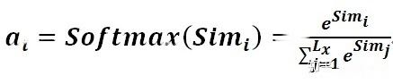

阶段三 然后再去根据计算出来的值再去和value做加权

以下就是注意力机制的图解

这是注意力机制

能从上图直观感受到 他对这种 序列到序列的（比如翻译）很在行，

不过怎么让计算机去理解我们句子本身呢，比如说续写

那就来到了自**注意力机制**了

***醒醒，同学！！这里很精彩的呢！！\***

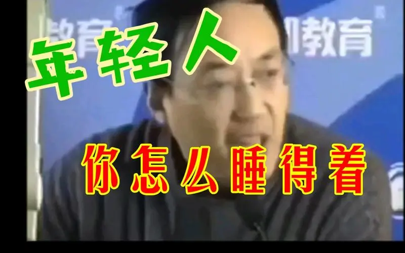

### **Self attention**

自注意力机制其实和注意力机制很像，但是最大的区别就是在于Q

我们上面的注意力机制是 Q 是另一个句子的查询向量，这样才能去找到对应关系

比如还是这张图

法语和英语的对应

而我们引入的是自身序列之后，

还是以上的流程只是在引入Q 还有归一化计算上做一些更改

举个例子

***The animal didn't cross the street because it was too tired\***

如果是用我们的 自注意力机制 最后我们得到了这种关联，以it为例，**it 肯定指代的就是animal**

注意力机制的好处显而易见，没有记忆力的限制，每个词，计算上因为没有以前那种依赖，我们可以把所有词都当q进行并行计算效率更高。

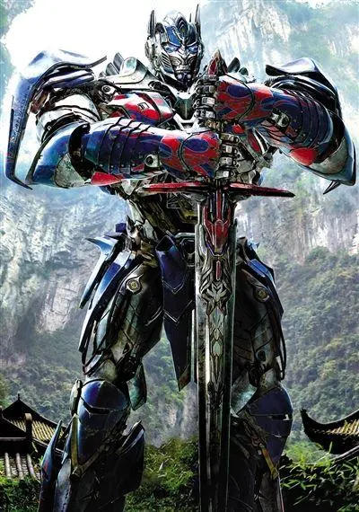

### **Tranformer**

好的，终于绕了一大圈，我们终于扯到了 GPT里面的 T

他的本质其实是 Encoder-Decoder 结构

顾名思义

Encoder 是专门去编码输入的文本，

Decoder 是运用编码的文本输出自己答案

上图是一个翻译，但实际上transformer已经有自主理解回答的能力

当然这张图可以再复杂点（篇幅原因很多就不细讲了）

左侧是编码器，右侧是解码器

先说解码器部分

#### **Decoder**

##### **Input embedding**

第一步还是做文本数据的向量化

##### **Positional Encoding**

是将文本的位置向量掺入其中（其实前面注意力模型比较关注词语和词语之间关系，但是不太关注位置信息，所以可以把位置加上）

#####  

##### **Muti-Head Atenttion**

就是我们上面说的 注意力机制了，可能细心的同学可以发现，这里写的是 multi-head Atenttion，啥是multi-head，在这里其实表达的意思是，我们上文提到的Q,K,V在不同的向量空间，投影矩阵也不一样，所以可以计算出多种注意力值。

想象一下，你正在阅读一本书，书中提到了一个重要的词语。你可能会将注意力集中在这个词语上，同时也会注意到其他相关的词语。多头注意力机制就是模仿这种思维方式。

在多头注意力机制中，我们把一段文字分成不同的片段，每个片段都有自己的重要性。我们使用一个头来计算每个片段的重要性，并将这些重要性相加起来，得到最终的注意力分数。这样，我们就可以关注不同的片段，并根据它们的重要性对整个文本进行理解。

##### **Add & norm 和 feed forward** 

这这里主要就是做了些数据处理 方便数据传递，以及后一层训练的处理 防止数据梯度出现消失或者爆炸的问题 [图片] 然后就是重复 n次（一般n等于6）

#### **Encoder** 

我们看绿框部分，其实有点类似于上面讲的decoder的部分

- 接收decoder传输来的数据，继续进行多头
- 而红色部分呢是表示编码器前面生成的部分，注意力机制计算，然后继续参入解码器新的内容继续参与运算，这样一直迭代下
- 一般这个过程 开始会有一个开始的标志<start>，结束也有结束的标志 <end>，这样有开始结束标志，也不用考虑生成的字符数应该是多少

补充说明: Masked self attention指的的是：**将mask位置对应的的attention score变成一个非常小的数字或者0，让其他单词再self attention的时候（加权求和的时候）不考虑这些单词**。

### **GPT**

Transformer 是一开始提出的基础理论框架，在实际的应用中各家又基于此做出了各自有侧重点的框架

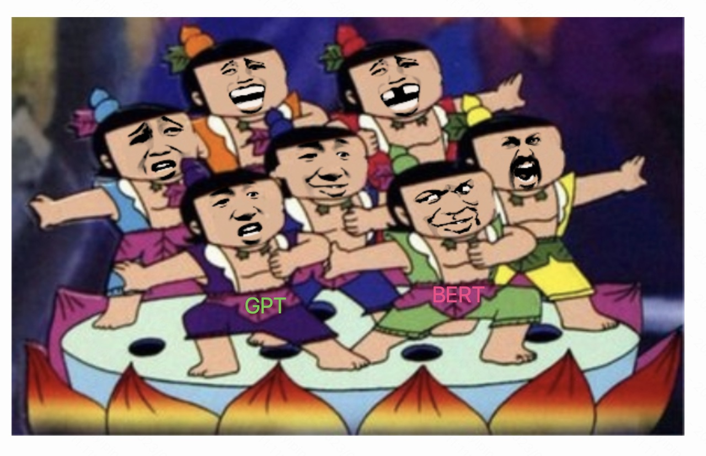

其中最有名的是谷歌自己的[BERT](https://arxiv.org/abs/1810.04805) 还有一个就是 OpenAI的GPT

不过他们各自取用了 transformer这里面不同的部分去做训练

BERT使用的是 transformer encoder的部分

GPT呢 则是使用的是decoder的部分

这两部分是能拆开使用的

#### **BERT**

BERT（Bidirectional Encoder Representations from Transformers）是一种双向模型，它通过同时学习文本的前向和后向上下文来获取深入的语义理解。这使得BERT在处理需要对上下文进行全面理解的任务（如问答、命名实体识别等）方面有优势。BERT通过预训练和Fine Tune（微调）两个阶段进行训练，预训练阶段使用了大量非结构化文本来学习通用的语言表示，而在微调阶段则针对特定任务进行优化（需要指定数据集）。

> **关键点 双向 微调**

#### **GPT**

GPT（Generative Pre-trained Transformer）是一种单向（从左到右）模型，主要关注根据给定的上下文生成文本。相较于BERT，GPT在生成性任务（如文本生成、摘要等）上表现更好。GPT也采用了预训练和微调（prompts）的策略，但它的训练目标更注重文本生成，而且他的微调非常简单不需要新的数据集，而是你输入（prompts）的形式告诉他要怎么做，做什么他就可以做到相应的任务。

> **关键点 单向 prompts**

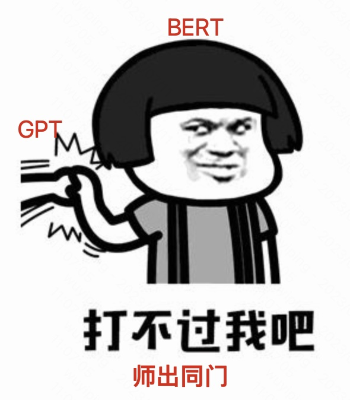

**在最初的阶段**，很明显BERT显得更专业，更加适合单个专业领域AI，所以一开始在专业领域，GPT无法在一些需要对上下文进行深入理解的任务中超越BERT。毕竟BERT是对全文去理解，GPT一开始就是有自废武功的嫌疑。GPT毫无疑问是被吊打的，而且当时AI大家的统一观点就是 专业AI做专业的事，比如识图的就是识图，翻译的就是搞翻译，写代码的就是写代码。

 一般人的话可能就把GPT改造成专职的代码机器人或者翻译机器人走专攻路线了，但是OpenAI铆足了劲要搞大力出奇迹，觉得生成的结果不好，那肯定是数据量不够多，所以继续疯狂堆料。

从GPT-2到GPT-3，模型的参数数量和训练数据规模都大幅增加，使得GPT在各种NLP任务中的性能得到了显著提升。

GPT-3是一次惊人的变革，它具有超过1750亿个参数的时候，出现了奇迹。

**它好像会自己思考了**

GPT-3表现出了强大的零样本（zero-shot）和少样本（few-shot）学习能力，在很多任务中可以在不进行微调的情况下达到甚至超越BERT的性能。GPT-3的出现引发了对大规模预训练模型潜力的广泛关注，并为自然语言处理领域带来了许多创新和应用。 

那么后来的故事大家都知道了 GPT3.5 开始对外商业化，GPT4大家更是一票难求。

## **实践探索** 

### **MLC-LLM**

#### [**https://mp.weixin.qq.com/s/dfaunRVhjuuI17JBPRM4Fw**](https://mp.weixin.qq.com/s/dfaunRVhjuuI17JBPRM4Fw)

手机运行大模型

### **nanoGPT**

#### [ **https://github.com/karpathy/nanoGPT**](https://github.com/karpathy/nanoGPT) 

（自己训练可以生成文本的机器人） 训练

训练

输出

### **Chatpdf**

​	https://www.chatpdf.com/c/94UDGguPTogxWUnklJtBM

### **自己弄一个 ChatPDF**

  https://github.com/hwchase17/langchain

  https://github.com/jerryjliu/llama_index

## **ChatGPT的使用**

对于我们写代码来说ChatGPT使用价值是显而易见的

### **写代码**

### **处理数学问题**

### **梳理文档**

### **支持的插件（需要gpt plus才行）**

需要设置下 支持beta模式

然后就能看到相应的插件了

## **ChatGPT的注册**

### **注册教程 （必须国外ip 国外电话号）**

[ChatGPT注册教程（完整指南）](https://github.com/xiaoming2028/FreePAC/wiki/ChatGPT注册教程（完整指南）)

###  

### **充值PLUS**

#### **国外信用卡**

说实话最近打的比较严格，这么充值可能会被取消

[ChatGPT Plus官方推荐新手教程](https://chatgpt-plus.github.io/) 

#### **ios礼品卡**

需要  美区apple id，支付宝购买礼品卡，ChatGPT ios客户端

[ChatGPT Plus 最新开通攻略:美区App Store方案(20230529更新) - 掘金](https://juejin.cn/post/7238423148555812925)

### **总结**

（因为某些封禁的原因）  为了能用上一次gpt真的很不容易，注册充值先搞个一天两天的，不见得能用上，用上了不见得能用的长...

##  

## **平替**

能顺顺利利的使用几次GPT其实并不容易，充plus可能会掉，普通的号隔一段时间可能就被封了

所以我们能不能不那么折腾的使用GPT，有一些平替网站可以能跟GPT唠唠。

### [**https://chat.forefront.ai/**](https://chat.forefront.ai/)   **GPT4 Claude**

### [**https://chat.theb.ai/**](https://chat.theb.ai/)   **GPT3  GPT3.5**

### [**https://bing.com/chat**](https://bing.com/chat)  **GPT3.5/4**

### [**you.com**](https://you.com/)   **GPT-3.5 / Internet**

###  

### **更多** [**https://github.com/xtekky/gpt4free**](https://github.com/xtekky/gpt4free)

------

## **引用**

[https://en.wikipedia.org/wiki/Georgetown%E2%80%93IBM_experiment](https://en.wikipedia.org/wiki/Georgetown–IBM_experiment)

[https://jalammar.github.io/illustrated-word2vec/](https://jalammar.github.io/illustrated-word2vec)

[http://jalammar.github.io/illustrated-transformer/](http://jalammar.github.io/illustrated-transformer)

[https://coladrill.github.io/2018/09/05/Attention%E6%9C%BA%E5%88%B6/](https://coladrill.github.io/2018/09/05/Attention机制)

https://blog.csdn.net/u011984148/article/details/99440105

https://mp.weixin.qq.com/s/jx-2Ai2YKbwODW6uJaF3hQ

[http://www.bimant.com/blog/transformer-illustration/](http://www.bimant.com/blog/transformer-illustration)

https://www.jiqizhixin.com/articles/2019-09-03-14

https://towardsdatascience.com/deconstructing-bert-part-